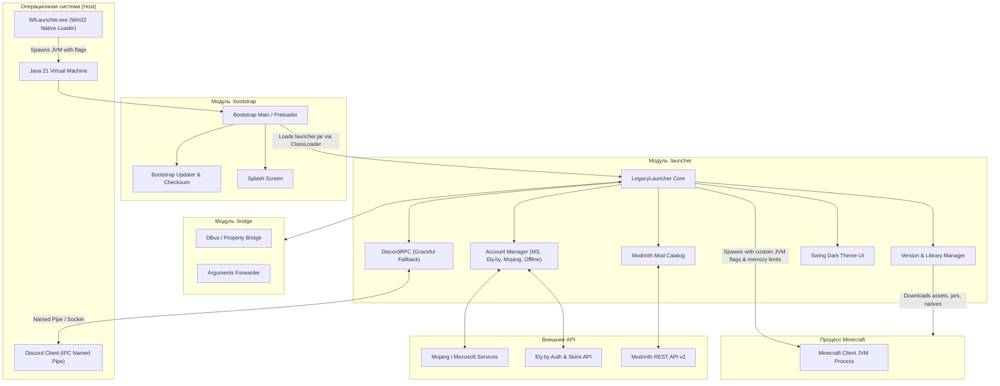

# Архитектурная спецификация WlLauncher (ARCHITECTURE.md)

Документ описывает внутреннюю структуру, взаимодействие компонентов, жизненный цикл запуска и сетевые интеграции **WlLauncher**.

---

## 🏛️ Высокоуровневая диаграмма компонентов

---

## 📦 Модули проекта и их ответственность

### 1. `:bootstrap` (Загрузчик первого этапа)
- **Цель**: Легковесная входная точка (`bootstrap.jar`), минимизирующая время первичного запуска.
- **Обязанности**:
  - Отображение стартового сплэш-экрана без загрузки тяжелых GUI-библиотек.
  - Проверка целостности и версии основного файла `launcher.jar`.
  - Загрузка `launcher.jar` в изолированный `URLClassLoader` с защитой от блокировки файлов операционной системой.
  - Передача аргументов командной строки и системных свойств.

### 2. `:bridge` (Связующий мост)
- **Цель**: Абстракция взаимодействия между независимыми слоями загрузчика и основного приложения.
- **Обязанности**:
  - Реализация интерфейсов обмена событиями и свойствами (Property Dispatcher).
  - Безопасная передача конфигурационных параметров при переходе из bootstrap в launcher.

### 3. `:launcher` (Основное приложение)
- **Цель**: Полнофункциональный клиент лаунчера (`launcher.jar`).
- **Ключевые подсистемы**:
  - `net.legacylauncher.ui`: Пользовательский интерфейс на базе Swing с кастомным рендерингом, темной темой, отзывчивой компоновкой и масштабированием шрифтов под High DPI.
  - `net.legacylauncher.user`: Мульти-аутентификация с поддержкой:
    - Официальных аккаунтов **Microsoft OAuth2**.
    - Сторонней авторизации и скинов **Ely.by**.
    - Локальных (офлайн) профилей.
  - `net.legacylauncher.managers.VersionManager`: Загрузка манифестов версий от Mojang, локальный парсинг JSON-структур, валидация контрольных сумм библиотек и распаковка нативных библиотек (`natives`).
  - `net.legacylauncher.modrinth`: Встроенный REST-клиент к каталогу **Modrinth** с поддержкой асинхронного поиска, декодирования WebP-иконок и загрузки файлов в `.minecraft/mods`.
  - `net.legacylauncher.rpc.DiscordRPC`: Легковесный клиент Discord IPC с экспоненциальным backoff и авто-восстановлением.
  - `net.legacylauncher.minecraft.launcher.MinecraftLauncher`: Конструктор аргументов запуска Minecraft (выделение памяти, JVM-оптимизации, параметры аутентификации, classpath).

### 4. `:common` (Общие сущности)
- **Обязанности**:
  - Форматы сериализации JSON / Properties.
  - Статические константы, протокольные схемы и кросс-модульные модели данных.

### 5. `:utils` (Низкоуровневые утилиты)
- **Обязанности**:
  - Асинхронные потоковые пулы (`AsyncThread`).
  - Файловые операции (`FileUtil`), парсинг путей операционных систем (`OS`, `MinecraftUtil`).
  - Сетевые утилиты с повторными попытками при сбоях (Retrying HttpClient).

---

## 🔄 Жизненный цикл запуска Minecraft

1. **Инициализация**:
   - Пользователь выбирает версию игры, аккаунт и нажимает кнопку **«Запустить»** (`PlayButton`).
2. **Проверка авторизации**:
   - `Authenticator` проверяет валидность токена пользователя (Microsoft / Ely.by) или обновляет его при необходимости через `refresh_token`.
3. **Разрешение манифеста версии**:
   - `VersionManager` проверяет наличие `versions/<version>/<version>.json`.
   - Если версия не установлена или требует обновления, скачиваются недостающие библиотеки и ассеты.
4. **Формирование аргументов JVM и запуск**:
   - Вычисляется оптимальный объем RAM на основе системных настроек и `MemoryAllocationService`.
   - Добавляются оптимизированные флаги сборщика мусора (G1GC).
   - Распаковываются нативные библиотеки (`natives`) во временную директорию.
   - Запускается дочерний процесс `java.lang.ProcessBuilder`.
5. **Discord Rich Presence**:
   - Лаунчер переходит в состояние `setInGame(version, playerName)`, транслируя статус в Discord.
