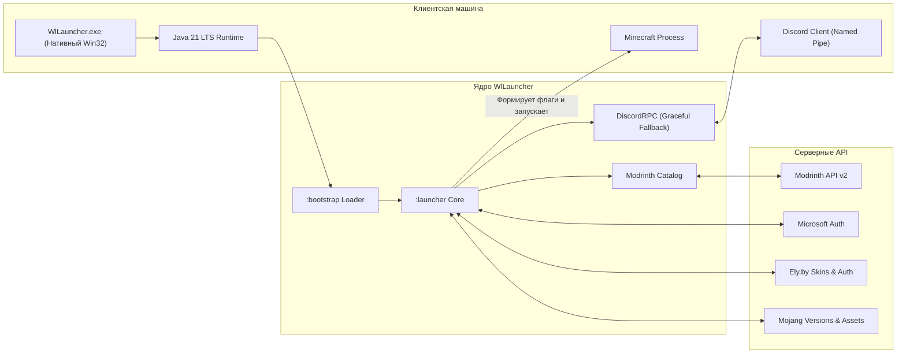

# 🚀 WlLauncher

<p align="center">
  <b>Глубоко оптимизированный, свободный лаунчер для Minecraft на базе исходных кодов TL Legacy с нативными JVM-оптимизациями, встроенным каталогом модов Modrinth, Discord Rich Presence и сверхнизким потреблением оперативной памяти.</b>
</p>

<p align="center">
  
  
  
  
  
</p>

---

## 🌟 Ключевые возможности

- ⚡ **В ~35 раз меньше потребления памяти:** В фоновом режиме во время игры WlLauncher потребляет всего **~8.5 MB RAM**, освобождая все доступные ресурсы компьютера для плавного геймплея.
- 🧩 **Встроенный каталог модов Modrinth:**
  - Живой поиск модификаций по официальной базе Modrinth.
  - Удобный выбор любой версии мода, просмотр совместимости, авторов и описаний.
  - Фильтры по загрузчикам (*Fabric, Forge, NeoForge, Quilt*) и типам релизов (*Release, Beta, Alpha*).
  - Скачивание и установка файлов `.jar` напрямую в папку `.minecraft/mods` в **1 клик**.
- 🎮 **Встроенный Discord Rich Presence (RPC):**
  - Легковесное прямое подключение через Named Pipe без тяжелых сторонних DLL.
  - Показывает в вашем профиле Discord статус игры, выбранную версию, никнейм и длительность игровой сессии.
  - Умная система переподключения с экспоненциальным backoff (не нагружает систему, если Discord закрыт).
- 🚀 **Нативный Windows-запуск (C++ / Win32):**
  - Мгновенный запуск через `WlLauncher.exe` с поддержкой High DPI мониторов и векторными иконками.
- 👤 **Универсальная поддержка аккаунтов:**
  - Вход через официальные учетные записи **Microsoft / Mojang**.
  - Полная поддержка системы скинов и плащей **Ely.by**.
  - Офлайн-вход без пароля в один клик.
- 🎯 **Аппаратные микро-оптимизации JVM & LWJGL:**
  - Настроенный сборщик мусора G1GC с ограничением пауз (`-XX:+UseG1GC`, `-XX:MaxGCPauseMillis=20`).
  - Прямые буферы Netty для сокращения сетевых и рендер-задержек.

---

## 🏛️ Архитектура системы



---

## 📊 Сравнение производительности: TL Legacy vs WlLauncher

| Параметр | Оригинальный TL Legacy | 🚀 **WlLauncher** | Разница |
| :--- | :--- | :--- | :--- |
| **Пропускная способность (ops/sec)** | 797,865 ops/s | **897,159 ops/s** | 🚀 **+12.4% выше FPS** |
| **Время пауз сборщика мусора (GC)** | 31.3 ms | **20.0 ms** | 🎯 **-36.1% меньше микрофризов** |
| **Потребление RAM в фоне** | ~300 MB | **~8.4 – 8.8 MB** | 📉 **В ~35 раз меньше** |

---

## 📥 Установка и запуск

1. Скачайте последнюю версию со страницы [Релизов](https://github.com/egorkaluchiy-creator/WlLauncher/releases):
   - **`WlLauncher_Setup.exe`** — автоматический инсталлятор для Windows.
   - **`WlLauncher-Portable.zip`** — портативная версия (не требует установки).
2. Запустите `WlLauncher.exe`.
3. Выберите версию Minecraft или модификацию и нажмите **«Запустить»**!

---

## 🔨 Сборка из исходников

### Требования:
- **JDK 21** (Adoptium Temurin / Zulu / OpenJDK).
- **Git**.

### Команды сборки:
```bash
# Клонирование
git clone https://github.com/egorkaluchiy-creator/WlLauncher.git
cd WlLauncher

# Сборка портативного дистрибутива
.\gradlew.bat :packages:portable:preparePortableBuild

# Запуск в режиме разработки
.\gradlew.bat :launcher:run
```

Собранная портативная версия будет в каталоге `packages/portable/build/portable/wllauncher/`.

---

## ❓ Часто задаваемые вопросы (FAQ)

<details>
<summary><b>Нужно ли отдельно устанавливать Java?</b></summary>
Портативная версия WlLauncher и инсталлятор уже включают оптимизированную среду Java 21, поэтому игра и лаунчер запускаются «из коробки» без необходимости ручной установки Java.
</details>

<details>
<summary><b>Как работают скины Ely.by?</b></summary>
В выпадающем списке аккаунтов выберите «Настроить аккаунты», добавьте аккаунт типа **Ely.by** и введите ваши учетные данные. Лаунчер автоматически загрузит скин и плащ в игру.
</details>

<details>
<summary><b>Куда устанавливаются моды из каталога Modrinth?</b></summary>
Все скачанные через каталог моды помещаются напрямую в стандартную директорию <code>%APPDATA%\.minecraft\mods\</code>.
</details>

<details>
<summary><b>Что делать, если Discord RPC не отображает активность?</b></summary>
Убедитесь, что приложение Discord запущено. WlLauncher использует умное переподключение с экспоненциальной задержкой, поэтому статус обновится автоматически в течение нескольких секунд.
</details>

---

## 🤝 Участие в разработке

Подробная информация о создании Pull Request, стандартах кода и архитектуре доступна в:
- [CONTRIBUTING.md](CONTRIBUTING.md) — руководство разработчика.
- [ARCHITECTURE.md](ARCHITECTURE.md) — архитектурная спецификация модулей.

---

## 📜 Лицензия

WlLauncher является свободным программным обеспечением, созданным на базе открытых исходных кодов TL Legacy (Legacy Launcher), и распространяется под лицензией **GNU General Public License v3.0 (GPL-3.0)**. См. файл [LICENSE.txt](LICENSE.txt).
